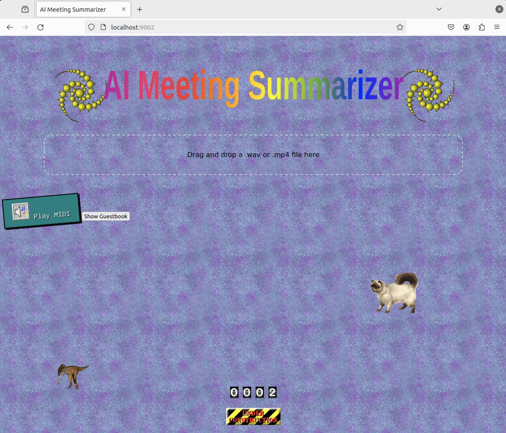

# AI Meeting Summarizer

<p align="center">
  
</p>

An AI-powered app for summarizing meeting videos working fully locally.

## Prerequisites

- macOS (Apple Silicon, at least 32GB RAM)
- Approximately 20GB of free disk space (for model download)

## Installation

1. Clone this repository:
   ```bash
   git clone <your-repository-url>
   cd <repository-directory>
   ```

2. Make the installation script executable:
   ```bash
   chmod +x install.sh
   ```

3. Run the installation script:
   ```bash
   ./install.sh
   ```

   This script will:
   - Install Homebrew (if not already installed)
   - Install Python 3.10, Go, ffmpeg, and wget
   - Create a Python virtual environment
   - Install all required Python packages
   - Download the Qwen2.5 model (~20GB)
   - Build the Go application

## Running the Application

1. Make the run script executable (only needed once):
   ```bash
   chmod +x run.sh
   ```

2. Start the application:
   ```bash
   ./run.sh
   ```

## Troubleshooting

If you encounter any issues:

1. Make sure all prerequisites are installed:
   ```bash
   brew install python@3.10 go ffmpeg wget
   ```

2. If the model download fails, you can manually download it:
   ```bash
   wget -O models/Qwen2.5-32B-Instruct-Q4_K_M.gguf \
       "https://huggingface.co/bartowski/Qwen2.5-32B-Instruct-GGUF/resolve/main/Qwen2.5-32B-Instruct-Q4_K_M.gguf?download=true"
   ```

3. Try rebuilding the application:
   ```bash
   source venv/bin/activate
   go build -o summarizer_server cmd/server/main.go
   ```

4. Check if the Python virtual environment is activated:
   ```bash
   source venv/bin/activate
   ```

## License

MIT

